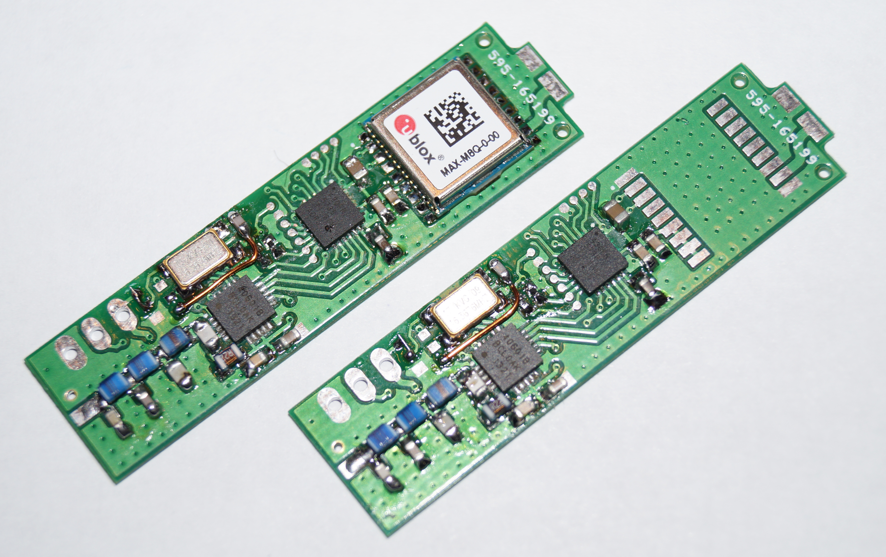

# uTrak miniature tracker repository

## Abstract 
This repository contains software and hardware design files for uTrak - the tracker of a series of small high altitude balloons. The software is implemented for a MSP430 MCU, with test programs runnable on a PC.
project documentation can be found here: http://www.dooce.de/dokuwiki/doku.php?id=projekte:utrak:start

The following tasks shall be performed by the software:
* Filtering and reading GPGGA-sentences from GPS - extracting position, altitude
* Measuring supply voltage with internal ADC
* Reading die temperature with internal ADC
* Generating telemetry frames (Including position, altitude, supply voltage, temperature)
* Configuring the Si4060 transmitter IC
* Power management for MCU and external hardware
* Transmission of APRS position reports

## GPS input
The MSP430 USART is used to store one NMEA-sentence to RAM (from $ to newline). Filtering and processing is controlled by a simple finite state machine. Fix data (position and altitude) are extracted and converted to HAB telemetry compatible format and APRS frames.

## Telemetry generation
From valid GPS data and telemetry data, packets are generated. The text string is formatted to be sent in 7 bit ASCII over RTTY. APRS transmission is done on EU APRS frequency (144.800MHz) and the telemetry frequency.

## Power management
Focus of the software is to get power consumption down as low as possible. This includes using all the available power saving features of the MSP430 and peripherals:
* Low power modes of the MSP430
* Disabling unused peripherals
* Power down mode of the GPS module
* Disabling RF stage

